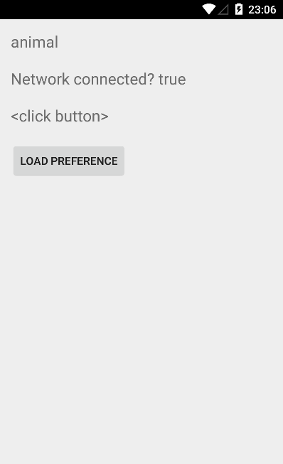

Dagger2 Example
=====================

This is just a sample project to demonstrate way of integrating [Dagger2](https://github.com/google/dagger) into your application. Have no clue what Dagger2 is? You should definitely watch this presentation.

Additionally, this app also stays as a demo of [retrolambda](https://github.com/orfjackal/retrolambda), [lombok](http://projectlombok.org/) and [butterknife](http://jakewharton.github.io/butterknife/) usage in yous android apps.

Feature missing? Pull requests are kindly welcome :)

